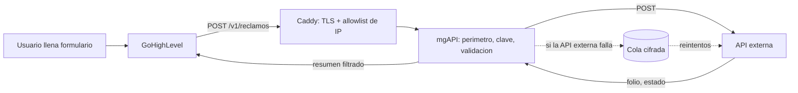

# Arquitectura

## Qué es mgAPI

Un intermediario. Un usuario llena un formulario de reclamos, GoHighLevel (GHL) recibe ese ingreso y
llama a mgAPI, y mgAPI reenvía el reclamo a la API externa que lo procesa de verdad.

mgAPI no es dueña de los datos: los recibe, los valida, los entrega y los olvida.

## Principio de diseño

**Lo que no se guarda no se puede filtrar.** Todo lo demás se deduce de ahí:

- No hay base de datos de datos personales.
- Los cuerpos de las peticiones nunca entran a los logs.
- La respuesta hacia GHL pasa por una lista blanca de campos: por defecto no sale nada.
- El único disco que toca un dato personal es la cola de reintentos, y ahí va cifrado.

## La tensión que resuelve la cola

"No guardar nada" y "no perder ningún reclamo" se contradicen cuando la API externa está caída.

La cola es el punto medio: el reclamo se escribe cifrado con AES-256-GCM, se reintenta con espera
creciente, y la fila se borra en cuanto la entrega se confirma. No es almacenamiento, es tránsito con
memoria corta. Un reclamo pasa por ahí solo cuando algo falló, y solo hasta que deja de fallar.

Si un reclamo agota sus reintentos pasa a la cola muerta, también cifrada, que se purga automáticamente
a los 7 días.

## Decisiones y por qué

| Decisión | Motivo |
|---|---|
| TypeScript + Fastify sobre Node 24 | Validación estricta con Zod, ecosistema maduro, y Node 24 ejecuta TypeScript directo: lo que se despliega es el mismo código que se lee, sin paso de compilación |
| Sin base de datos | Ninguna consulta puede filtrar lo que no existe |
| Cola en SQLite con `node:sqlite` | Viene en la biblioteca estándar de Node: una dependencia menos que auditar y actualizar |
| Cifrado con `node:crypto` | Misma razón: sin dependencias de terceros en el camino crítico de los datos |
| Caddy delante | HTTPS automático y renovado solo, más una capa de allowlist de IP antes de que el tráfico toque la aplicación |
| Docker con sistema de archivos de solo lectura | Un atacante que logre ejecución no puede dejar nada persistente |
| `node:24-slim` en vez de distroless | La imagen distroless complica diagnosticar la cola SQLite en producción. La superficie se reduce con usuario sin privilegios, `cap_drop: ALL` y `read_only`, que cubren lo mismo en la práctica |

## Mapa del código

| Archivo | Responsabilidad |
|---|---|
| `src/env.ts` | Valida el entorno al arrancar. Si falta un secreto, el proceso no parte |
| `src/app.ts` | Arma Fastify con todas sus capas: helmet, límite de tasa, límite de cuerpo, redacción de logs, manejo de errores |
| `src/server.ts` | Punto de entrada: levanta el servidor y lo apaga de forma ordenada |
| `src/security/autenticacion.ts` | Verifica quién llama: clave compartida y, si está activa, firma HMAC con anti-repetición |
| `src/security/perimetro.ts` | Allowlist de IP con soporte CIDR y bloqueo de IP por claves incorrectas seguidas |
| `src/security/cifrado.ts` | AES-256-GCM para la cola |
| `src/schemas/reclamo.ts` | Esquema estricto de entrada, validación de RUT y patente, y lista blanca de salida |
| `src/upstream/cliente.ts` | Llamada a la API externa con timeout, sin redirecciones, y presupuesto diario de gasto |
| `src/cola/cola.ts` | Cola cifrada, reintentos con espera creciente y cola muerta |
| `src/routes/reclamos.ts` | El endpoint `POST /v1/reclamos` |

## Lo que falta definir

La lógica específica de la API externa (formato exacto del cuerpo, límites, costo por consulta) todavía
no está definida. Está aislada en `src/upstream/cliente.ts`: conectarla no obliga a tocar nada más.
